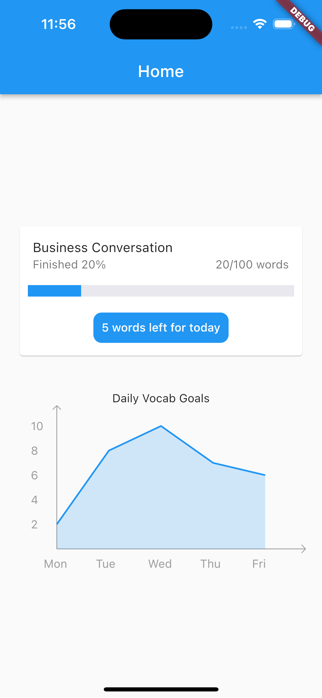
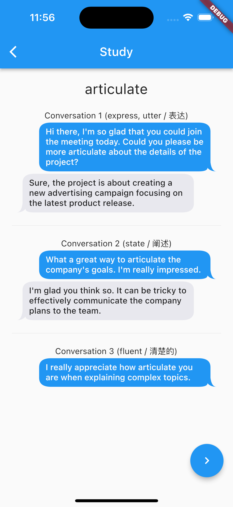
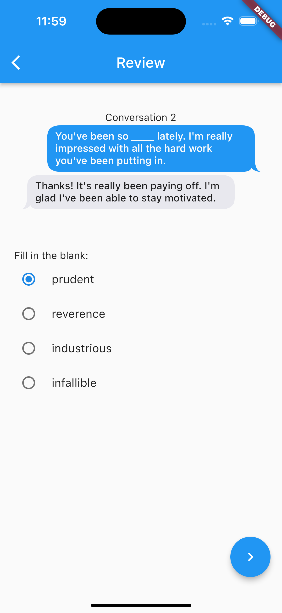

# L2Z

Our app, L2Z, helps L2 English learners grow their mastery of the language in whichever area they most need to learn. We found that L2 learners don't need to have perfect grammar and vocabulary but have specific use cases in their daily lives that they need to use English. We help them reach their goals in less time by generating context-based vocabulary lessons using natural language processing. Based on a provided context, we are able to generate a list of vocabulary that is heavily used within that context that they may not be familiar with. We then form these words into sentences along with words they already know in the context they provided to help their learning.

# Gallery
## Home screen

## Study screen

## Review screen

